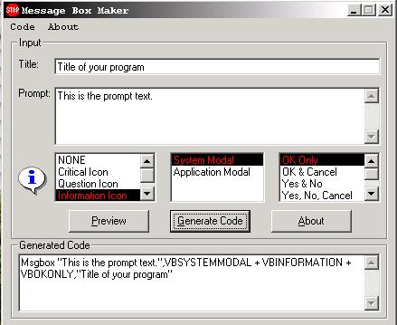



## MSGBOX Maker Example

### Description

This is a complete application that generates the vb syntax for a msgbox code for you.
 
### More Info
 

             |
---                |---
**Submitted On**   |2002-05-06 20:11:16
**By**             |[Jaime Muscatelli](https://github.com/Planet-Source-Code/PSCIndex/blob/master/ByAuthor/jaime-muscatelli.md)
**Level**          |Beginner
**User Rating**    |3.8 (15 globes from 4 users)
**Compatibility**  |VB 6\.0
**Category**       |[Complete Applications](https://github.com/Planet-Source-Code/PSCIndex/blob/master/ByCategory/complete-applications__1-27.md)
**World**          |[Visual Basic](https://github.com/Planet-Source-Code/PSCIndex/blob/master/ByWorld/visual-basic.md)
**Archive File**   |[MSGBOX\_Mak965496192002\.zip](https://github.com/Planet-Source-Code/jaime-muscatelli-msgbox-maker-example__1-36031/archive/master.zip)

